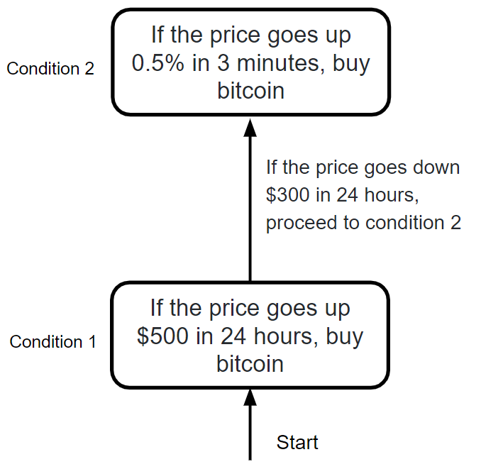
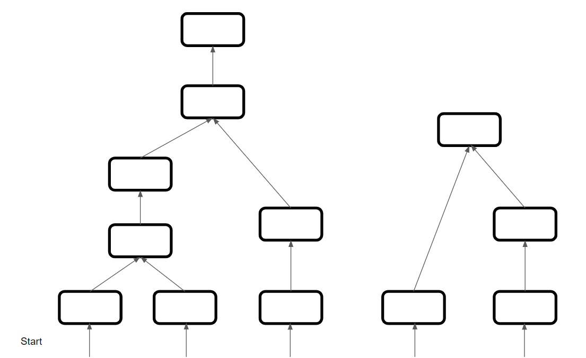

# Fruit Tree Crypto Trading
Fruit Tree Crypto Trading is an opensource project for creating a custom "build-your-own" crypto auto-trader.

Fruit Tree Crypto Trading offers support for the following crypto exchanges:
- Coinbase Pro
- Robinhood

### Basics
Fruit Tree Crypto Trading is based upon the following idea:
- When there is an indication that a coin's price is going up, and the user has their money in USD, it will buy some amount of the cryptocurrency
- When there is an indication that a coin's price is going down, and the user has their money in the cryptocurrency, it will sell the specified amount of cryptocurrency

This idea is a very abstracted version of what Fruit Tree Crypto Trading can do.

What makes Fruit Tree Crypto Trading especially unique is how **trading conditions can be used as singly linked lists and trees**, which is where Fruit Tree Crypto Trading gets its name.

### Getting Started
Read through the following to understand the usage and the functionality of the Fruit Tree Crypto Trading.

Customize your own trading conditions through the use of config files (see below) and use trading conditions as trees and links (also see below) to further customize how you want to trade Crypto.
## Trading Condition Trees and Links

Fruit Tree Crypto Trading uses the idea of trading conditions as nodes on a tree.

For example, a user can create 2 trading conditions that buy bitcoin: 
- (ID = 1) If the price goes up $500 in 24 hours, buy bitcoin
- (ID = 2) If the price goes up 0.5% in 3 minutes, buy bitcoin

However, the user doesn't want the auto-trader to be checking the two conditions at the same time; the user only wants the condition 1 to be under review until bitcoin goes down $300 in the same 24 hour period, which would then disable condition 1 and enable condition 2. The new set of conditions would look like this:
- (ID = 1) If the price goes up $500 in 24 hours, buy bitcoin
  - If the price goes down $300 in 24 hours, proceed to condition 2
- (ID = 2) If the price goes up 0.5% in 3 minutes, buy bitcoin

In a more visual manner, this would look like:
<p align="center">

</p>
Because of this, large trees can be made, where conditions can have many previous links, but only one next link:

<p align="center">

</p>

Using trading conditions as nodes in trees IS NOT REQUIRED. Many trading conditions can be run simultaneously without any connection between them. The trading conditions can be as simple or complex as you would like.

Notes on hierarchy of trading conditions:
- The trading conditions that will be looked into first will be the trading conditions that don't have any previous conditions. Using the same example as above, trading condition 1 will always start the possible buying process. You don't need to specify which trading condition will start the process.
- Trading condition loops are not allowed. For instance, if the next link of trading condition 1 is trading condition 2, trading condition two can't have the next link being itself or trading condition 1.

## Trading Condition Creation

For "buy" conditions, edit ```TradeConditions/buy-conditions.conf```

For "sell" conditions, edit ```TradeConditions/sell-conditions.conf``` 

### Outline
Every trade condition is separated into its own section by the ```[ID]```.

- ```[ID]```: The ID of the trading condition. Can be anything, as long as it is unique to that specific condition.
- ```PERCENT_UP```: If the price goes up X%, from ```FROM_UP``` 
    - Optional if in ```sell-conditions.conf```
    - Only use one of ```PERCENT_UP``` or ```PRICE_UP```
- ```PRICE_UP```: If the price goes up $X, from ```FROM_UP```
    - Optional if in ```sell-conditions.conf```
    - Only use one of ```PERCENT_UP``` or ```PRICE_UP```
- ```FROM_UP```: Either from the minimum price in the interval "INTERVAL_PRICE", or minimum price since the time of the last trade "TRADE_PRICE"
    - Optional if in ```sell-conditions.conf```
- ```PERCENT_DOWN```: If the price goes down X%, from ```FROM_DOWN```
    - Optional if in ```buy-conditions.conf```
    - Only use one of ```PERCENT_DOWN``` or ```PRICE_DOWN```
- ```PRICE_DOWN```: If the price goes down $X, from ```FROM_DOWN```
    - Optional if in ```buy-conditions.conf```
    - Only use one of ```PERCENT_DOWN``` or ```PRICE_DOWN```
- ```FROM_DOWN```: Either from the maximum price in the interval "INTERVAL_PRICE", or the maximum price since the time of the last trade "TRADE_PRICE"
    - Optional if in ```buy-conditions.conf```
- ```INTERVAL```: The interval in seconds for looking at recent minimum/maximum prices
    - Optional if ```FROM_UP``` != INTERVAL_PRICE and ```FROM_DOWN``` != INTERVAL_PRICE
- ```NEXT_LINK```: The condition ID for the next condition link assuming this condition is exceeded
    - Optional

### Examples


#### buy-conditions.conf:
```bash
[A]
PRICE_UP=10
FROM_UP=TRADE_PRICE
```
This trading condition buys crypto if the price goes up $10 since the last trade price.

#### sell-conditions.conf:
```bash
[4]
PERCENT_DOWN=0.5
FROM_DOWN=INTERVAL_PRICE
INTERVAL=20
```

This trading condition sells crypto if the price goes down 0.5% from the maximum price in the last 20 seconds.

#### buy-conditions.conf:
```bash
[A]
PRICE_UP=10
FROM_UP=TRADE_PRICE

[2]
PERCENT_UP=1
FROM_UP=INTERVAL_PRICE
PRICE_DOWN=20
FROM_DOWN=TRADE_PRICE
INTERVAL=30
NEXT_LINK=A
```

This set of trading conditions starts at buy condition "2", which says to buy crypto if the price goes up 1% from the minimum price in the last 30 seconds. However, if the price goes down $20 since the last trade, the buy condition "2" gets nullified and the new trading condition being looked at in the tree is "A", which buys crypto if the price goes up $10 since the last trade price.

## Running Fruit Tree Crypto Trading

Once all the trading conditions are set, simply run the following
```bash
./Fruit-Tree.sh
```
Necessary packages will be downloaded and you will be asked private information about the crypto exchange service you are looking to use, which could be:
- Service name
- Coin to trade
- Username/email
- Password
- API Key
- API Secret
- etc.

Additionally, you will be asked about a sell floor, which will cause an immediate sell and stop the program.

Once all questions are answered. The auto-trader will be up and running!

You can look at the progress directly through a file generated called "Account-Holdings.txt", or through your account on the crypto exchange.

## Stopping Fruit Tree Crypto Trading

To stop the auto-trader, in the terminal that is running, ```Ctrl+C```. Or if it is in a different terminal, enter ```nohup python3 -u /path/to/auto-trader.py```

## Features and Functionality

Fruit Tree Crypto Trading can be entirely on any server, including the free tier of an AWS EC2 instance. So, you don't have to worry about the reliability of connection and it can run efficiently for free.
